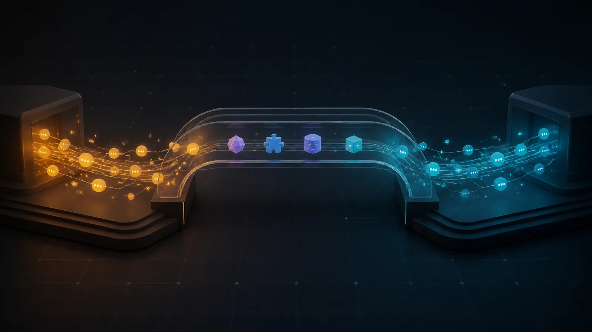
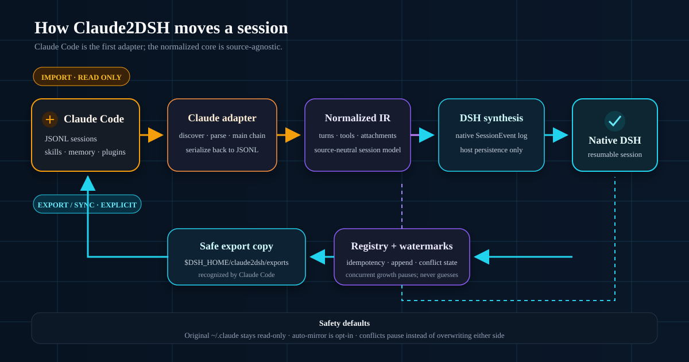
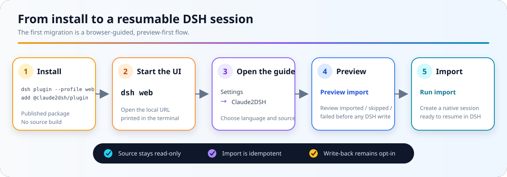
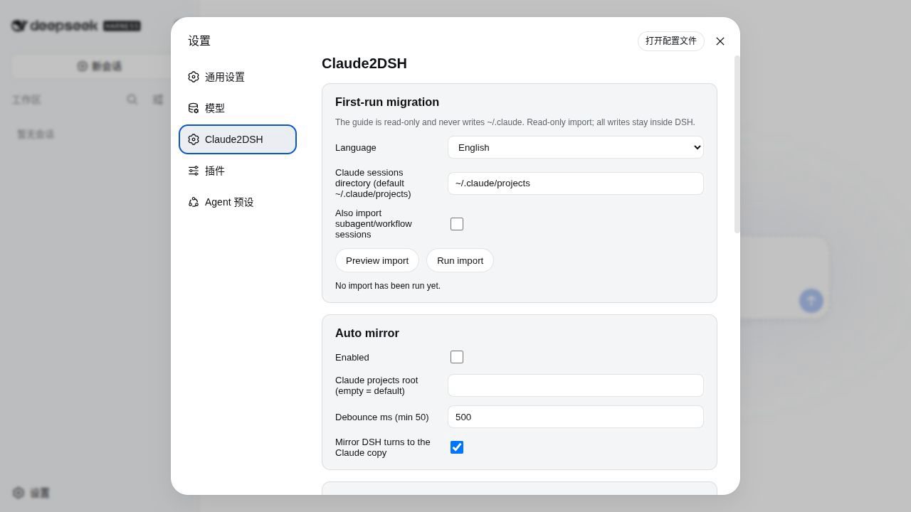
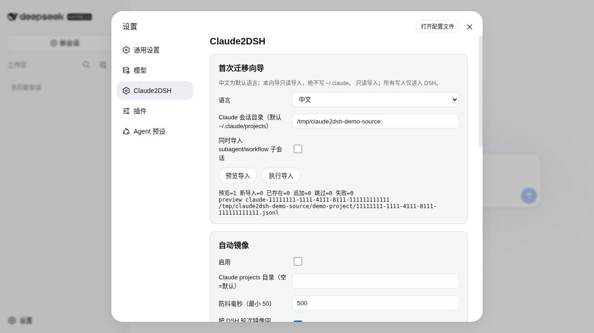
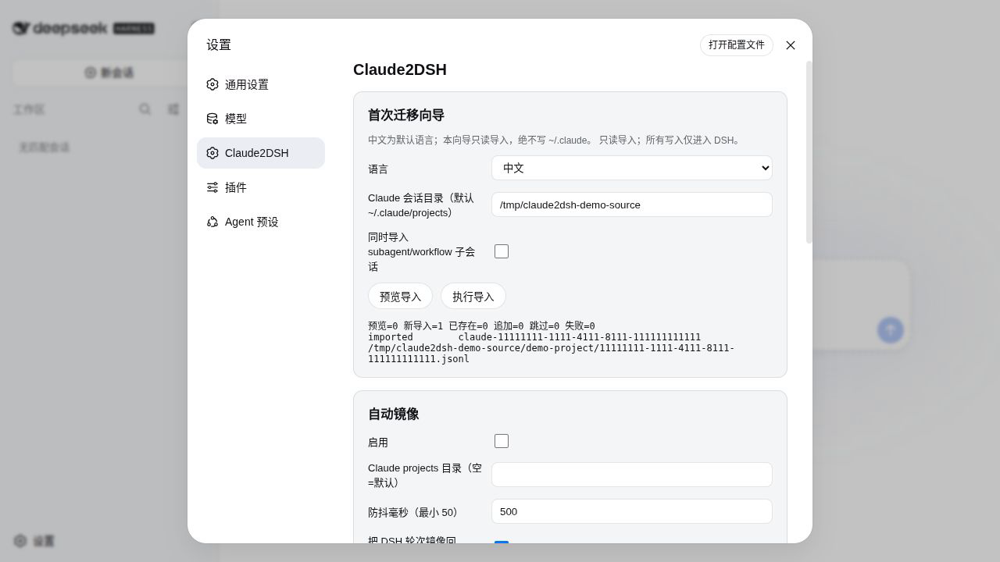
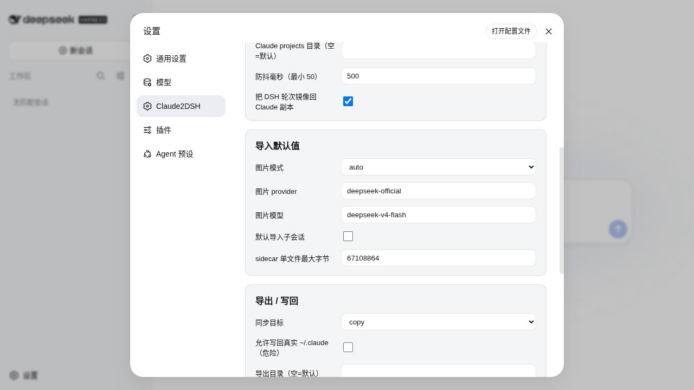
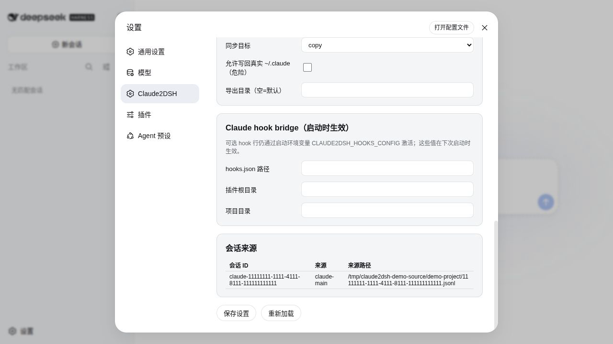

# Claude2DSH

**Move Claude Code conversations, skills, memory, and plugin assets into DeepSeek Harness as native, resumable sessions — and take DSH turns back to Claude Code JSONL when you need to.**

[](https://awesome-dsh-plugin.com)
[](https://www.npmjs.com/package/@claude2dsh/plugin)
[](https://github.com/kirkchinese/claude2dsh/releases)
[](package.json)
[](LICENSE)

[简体中文](README.zh.md) · [Design philosophy](docs/design-philosophy.md) · [Architecture](docs/architecture.md) · [Roadmap](docs/roadmap.md)



Claude Code is the first source adapter in a multi-tool migration layer. Claude2DSH preserves the useful conversation structure, writes through DSH's native persistence APIs, and keeps the original Claude directory read-only by default.

> [!NOTE]
> `0.2.0-rc.2` is a release candidate. The Awesome badge means the project is included in the curated [awesome-dsh-plugin](https://github.com/awesome-dsh-plugin/awesome-dsh-plugin) list under **Sessions & Messages**. The automatic [awesome-dsh-plugins](https://github.com/AdamPlatin123/awesome-dsh-plugins) radar has not marked it as runtime-verified; the badge does not claim that verification.

## Why Claude2DSH

| Resume natively                                                                         | Bring more than chat                                                                                                                           | Return without risking the source                                                                                           |
| --------------------------------------------------------------------------------------- | ---------------------------------------------------------------------------------------------------------------------------------------------- | --------------------------------------------------------------------------------------------------------------------------- |
| Claude turns become DSH-native session events that DSH can inspect, replay, and resume. | Skills, user-global instructions, project memory, tool-output sidecars, subagent transcripts, and plugin assets have explicit migration paths. | Export and sync target a safe copy under `$DSH_HOME` by default. Concurrent edits pause instead of overwriting either side. |

The governing principle is **foolproof out of the box**: the default path produces a visible result without requiring users to understand profiles or bundles first, while dangerous write-back remains explicitly gated. See the full [design criteria](docs/design-philosophy.md).



## Quickstart

Requirements: Node.js `>=22.19.0`, pnpm, and the `dsh` CLI.

```sh
# Install the published plugin into DSH's built-in headed profile
dsh plugin --profile web add @claude2dsh/plugin@0.2.0-rc.2

# Start the browser UI; the terminal prints the local URL
dsh web
```

Then:

1. Open the URL printed by `dsh web`.
2. On a fresh DSH installation, choose **Configure later** if the model API-key prompt appears; migration itself does not call a model.
3. Open **Settings → Claude2DSH**.
4. Choose a language, confirm the Claude sessions directory, and optionally include subagent/workflow transcripts.
5. Click **Preview import**, inspect the counts and item report, then click **Run import**.



The first screen is the migration guide; Chinese is the default UI language and English is selectable.



Preview is read-only and returns an itemized plan before any DSH write.



This is what a successful run looks like. The screenshot comes from the real `0.2.0-rc.2` UI using a synthetic, privacy-safe Claude transcript.



### Repository helper

If you cloned this repository, the helper performs the same install into the main `web` profile and starts the UI on port `18781`:

```sh
bash scripts/install-claude2dsh.sh
```

Set `CLAUDE2DSH_PROFILE` only when you intentionally want a custom profile. Headless profiles expose the same tools but do not include the browser UI.

## Capabilities: when and how to use them

| Capability           | Use it when                                                                 | Entry and visible result                                                                                                                    |
| -------------------- | --------------------------------------------------------------------------- | ------------------------------------------------------------------------------------------------------------------------------------------- |
| Session import       | First migration, or after the Claude transcript gains turns                 | **Settings → Claude2DSH → First-run migration**, or `claude2dsh_import`; reports `previewed/imported/already/appended/skipped/failed`       |
| Skill import         | Claude skills should become DSH-native discoverable assets                  | `claude2dsh_import_skills`; copied skills appear under `$DSH_HOME/skills` and in DSH skill discovery                                        |
| Global context       | Move user-global `~/.claude/CLAUDE.md` into DSH global instructions         | `claude2dsh_import_context`; previews first and never overwrites a different `$DSH_HOME/AGENTS.md`                                          |
| Project memory       | Make one project's `MEMORY.md` and `memory/*.md` discoverable in DSH        | `claude2dsh_import_memory`; creates one DSH skill bundle per project                                                                        |
| Export to Claude     | Continue a DSH session in Claude Code                                       | `claude2dsh_export`; writes a validated JSONL copy under `$DSH_HOME/claude2dsh/exports`                                                     |
| Sync back            | Append new DSH turns to an existing exported Claude copy                    | `claude2dsh_sync`; reports appended turns, events, and JSONL records                                                                        |
| Auto mirror          | Keep watching for new Claude turns and mirror DSH turns to the safe copy    | **Settings → Auto mirror**; `claude2dsh_autosync` shows status and resumes a paused queue                                                   |
| Conflict merge       | Both sides grew after the watermark and neither version may be lost         | `claude2dsh_merge`; computes or creates a new merged copy rather than changing either original                                              |
| Tool-output sidecars | A transcript references large persisted tool results                        | `claude2dsh_sidecars`; lists or resolves copied files and records missing/oversize items                                                    |
| Session sources      | Distinguish Claude main, subagent, and merged sessions                      | **Settings → Session sources**, or `claude2dsh_session_sources`; shows source kind and path                                                 |
| Plugin inventory     | Inspect Claude plugin assets without running Claude plugin code             | `claude2dsh_plugin_inventory`; dry-run reports skills, commands, agents, prompts, hooks, and marketplaces                                   |
| Image policy         | Preserve transcript images while respecting the selected model's modalities | Automatic with `imageMode: "auto"`; change policy under **Settings → Import defaults**                                                      |
| Hook bridge          | Reuse the supported subset of Claude command hooks                          | Set `CLAUDE2DSH_HOOKS_CONFIG` and the startup fields under **Settings → Claude hook bridge**; invocations and results enter the session log |

Session import is idempotent: running it again reports an existing session instead of duplicating it. Project-level `CLAUDE.md` is not copied because DSH already reads it natively; only user-global context needs conversion.

## Settings tour

The Claude2DSH settings page keeps the first migration and safety-critical defaults in one place:

- **First-run migration** — language, source directory, optional subagents, preview, run, and itemized result.
- **Auto mirror** — opt-in watcher, debounce, and DSH-to-safe-copy direction.
- **Import defaults** — image mode/provider/model, subagent default, and sidecar size cap.
- **Export / write-back** — safe-copy target by default; original `~/.claude` write-back is a separate dangerous switch.
- **Claude hook bridge** — startup-only paths and activation guidance.
- **Session sources** — imported session ID, source kind, and source path.

The following real screenshots use the default Chinese UI and synthetic data; labels switch with the language selector.





## Safety model

- Import treats the Claude source as read-only. Preview performs no DSH write.
- DSH writes go through host persistence and the DSH-native roots under `$DSH_HOME/sessions`, `$DSH_HOME/skills`, and `$DSH_HOME/claude2dsh`.
- Export and sync default to `$DSH_HOME/claude2dsh/exports`; they do not write the original `~/.claude`.
- Writing the original Claude directory requires explicit `allowOriginalClaudeDir: true` authorization and remains refused by default.
- Plugin inventory reads assets without executing plugin code.
- Auto mirror pauses on concurrent growth. The explicit merge tool creates a new safe copy instead of guessing which side wins.

## Current limitations

- **Release-candidate status:** the public package is `0.2.0-rc.2`; interfaces and on-disk formats are not presented as a stable compatibility promise yet.
- **Hook bridge:** the upstream bridge supports **7 of Claude Code's 30 hook events**, only `type: "command"` handlers, and partial semantics per supported event. Full hook compatibility is a roadmap goal, not a current claim.
- **Vision acceptance:** the native image path is implemented, but it has not been accepted against a real vision-capable DSH model route. The shipped DeepSeek adapter declares text-only input.
- **Auto mirror:** it is opt-in and off by default. It writes DSH turns only to the safe Claude export copy; when both sides grow, it pauses and reports a conflict. Automatic merge is not implied.
- **Plugin compatibility:** inventory and selected assets can migrate, but arbitrary Claude plugin runtime behavior is not automatically portable to DSH.
- **Source adapters:** Claude Code is currently the only adapter. Codex and other tools remain roadmap work.
- **Session-list decoration:** DSH has no per-session sidebar-row extension point, so source identity is shown in Settings and through `claude2dsh_session_sources` instead.

## Validation evidence

The project records reproducible checks in [docs/validation.md](docs/validation.md); these are not marketing estimates.

| Acceptance path                      | Recorded result                                                                                                                      |
| ------------------------------------ | ------------------------------------------------------------------------------------------------------------------------------------ |
| Main Claude transcripts              | 57 imported, 1 non-conversation skipped, 22,163 native events; every imported session inspected and resumed through DSH              |
| Claude skills                        | 39 copied skills discovered through DSH's native skill registry; a repeated import created no duplicates                             |
| Main + subagent/workflow transcripts | 782 imported, 1 skipped, 86,866 events; all 782 sessions inspected successfully                                                      |
| Bidirectional continuity             | Claude → DSH → Claude was exercised with real Claude and DSH model calls in isolated homes                                           |
| Published UI path                    | `@claude2dsh/plugin@0.2.0-rc.2` installed from npm into an isolated `web` profile; Settings and Preview import returned successfully |

## FAQ

<details>
<summary><strong>I installed the plugin but cannot see a UI.</strong></summary>

You probably used a headless profile. Install into the built-in `web` profile and start `dsh web`; the page is under **Settings → Claude2DSH**.

</details>

<details>
<summary><strong>Will it write my real ~/.claude?</strong></summary>

Not during migration. Export and sync also target a safe copy under `$DSH_HOME` by default. Original-directory write-back requires a separate explicit authorization.

</details>

<details>
<summary><strong>Why are Auto mirror and the hook bridge off by default?</strong></summary>

Both can execute work after the first import. They stay opt-in so the user sees and accepts their scope first; the hook bridge is also limited to the documented 7/30 command-only subset.

</details>

## Documentation

| Document                                             | Purpose                                                        |
| ---------------------------------------------------- | -------------------------------------------------------------- |
| [Design philosophy](docs/design-philosophy.md)       | Out-of-box and safety criteria                                 |
| [Architecture](docs/architecture.md)                 | Adapter, normalized IR, persistence, and reverse serialization |
| [Validation record](docs/validation.md)              | Reproducible evidence from each acceptance round               |
| [Roadmap](docs/roadmap.md)                           | Completed work and explicit future targets                     |
| [Gap list](docs/gap-list.md)                         | Target-state capability comparison                             |
| [Session Move interop](docs/session-move-interop.md) | Read-only integration with `dsh-session-move`                  |
| [Release checklist](docs/release-checklist.md)       | Packaging and release requirements                             |
| [Changelog](CHANGELOG.md)                            | Published and unreleased changes                               |

## Development

```sh
pnpm install
pnpm run check
pnpm -r build && pnpm -r typecheck && pnpm -r test
```

The end-to-end scripts use isolated DSH homes and source-data copies. See [the validation record](docs/validation.md) for the exact command matched to each acceptance path.

## License and acknowledgements

[MIT](LICENSE). Claude2DSH is a clean-room implementation informed by the public behavior of [`dsh-chat-import`](https://github.com/Nwflower/dsh-chat-import) (MIT) and [`dsh-claude-move`](https://github.com/PerryLink/dsh-claude-move) (Apache-2.0). Thanks to both projects for useful reference points. Hook compatibility delegates to the official DeepSeek Harness Claude Code hook bridge package.
