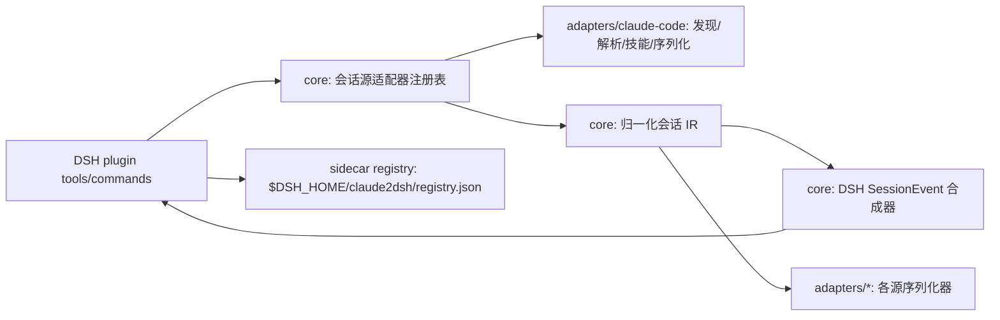

# Claude2DSH 架构（v0，自研）

## 目标

迁移层是"会话源适配器"框架：Claude Code 是第一个适配器，Codex/Gemini/
OpenClaw 后续添加适配器即可，不改 DSH 事件合成器与同步层。

## 分层



- `packages/core`：`SessionSourceAdapter` 接口、`NormalizedSession` IR、
  DSH 事件合成器、反向序列化所需的中介。零 DSH 运行时依赖。
- `packages/adapters/claude-code`：Claude Code JSONL 解析/主链选择/技能
  发现与 SKILL.md 校验/Claude JSONL 序列化。只依赖 core。
- `packages/plugin`：DSH 插件（Cordis）。注入 `sessionPersistence`、`tools`；
  注册工具与 `/claude2dsh` 命令；写 DSH 只走 `ctx.sessionPersistence`；
  技能与 registry 写 `$DSH_HOME`。
- `packages/cli`（R2 起）：无 DSH 进程时的只读勘察/校验/打印迁移计划。

## 核心抽象

```ts
interface SessionSourceAdapter {
  readonly id: string
  discover(root: string, opts): AsyncIterable<DiscoveredSession>
  readSession(ref: DiscoveredSession, opts): Promise<NormalizedSession>
  // 反向：把 DSH 事件增量序列化为源端原生格式（默认 dry-run）
  serializeAppend?(session, events, opts): Promise<SourceAppend>
}
```

## 数据面

- 读取：`~/.claude` 永远只读；实验副本必须存在。
- 写入 DSH：会话经 `ctx.sessionPersistence.create/append`；技能复制到
  `$DSH_HOME/skills/`；registry 写 `$DSH_HOME/claude2dsh/registry.json`。
- 写入 Claude：默认拒绝。仅当 `allowWriteback: 'explicit'` 且目标是用户
  指定的备份/输出目录（绝不默认 `~/.claude`）时执行；原目录写回另需
  显式 `allowOriginalClaudeDir: true`。
